# Solidity Introduction

## Smart Contracts

### Course Overview

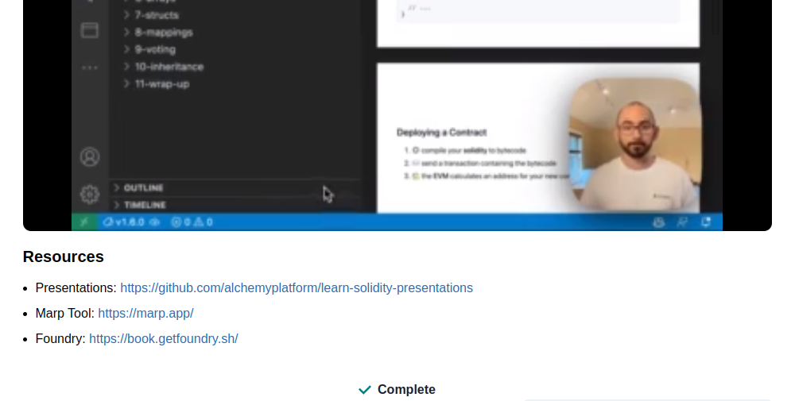

### Smart Contract Overview

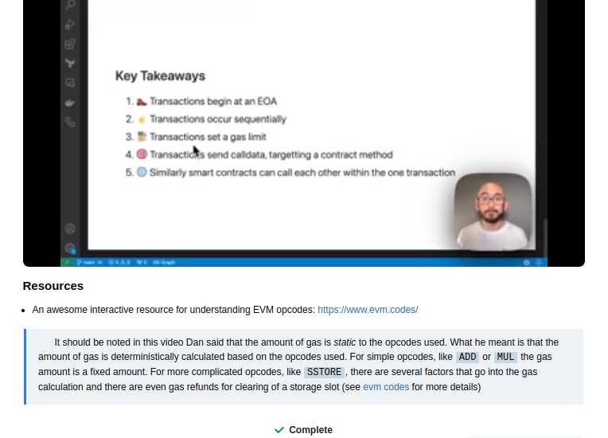

### Value Types

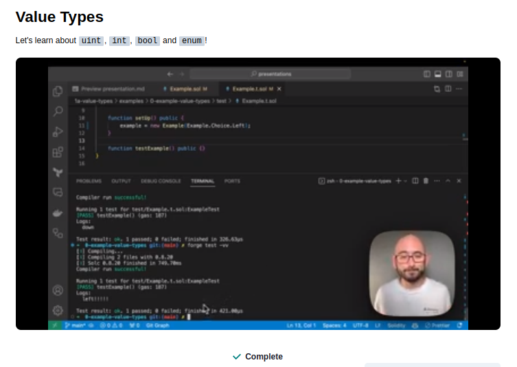

**Practice Data Types**

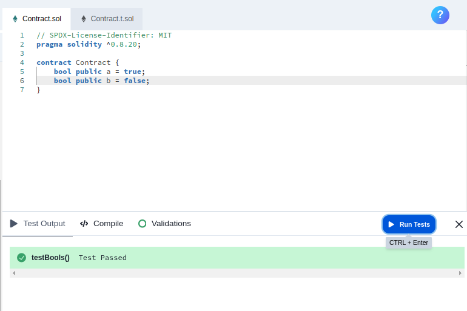

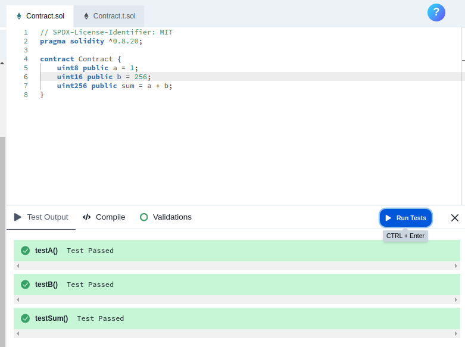

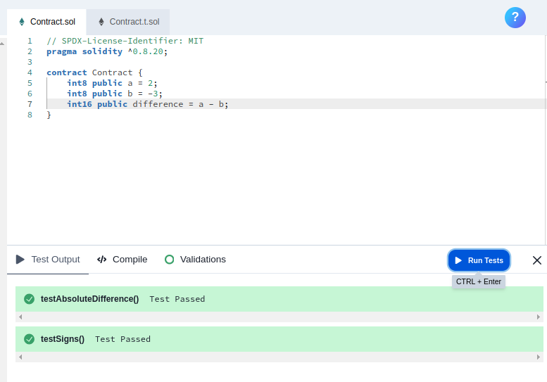

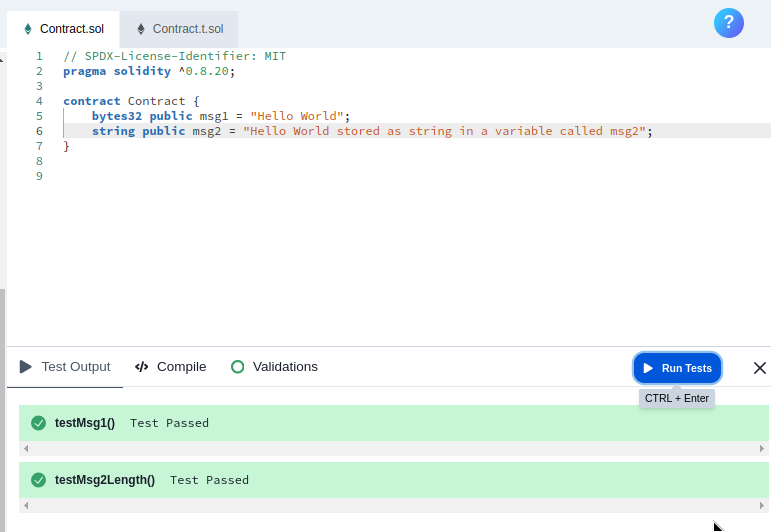

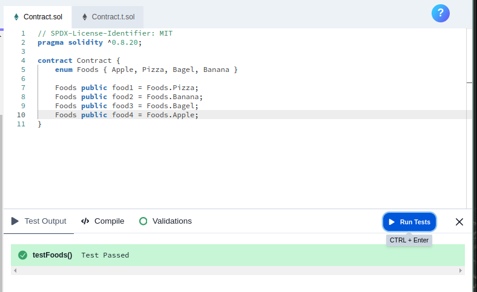

## Functions and Value Types

### Storage Variables

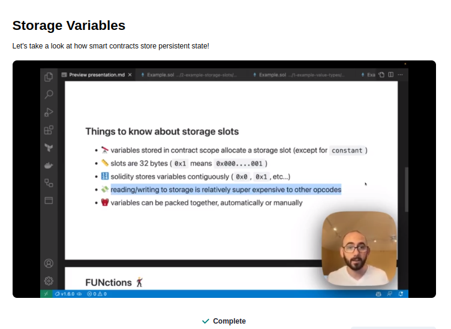

### Functions

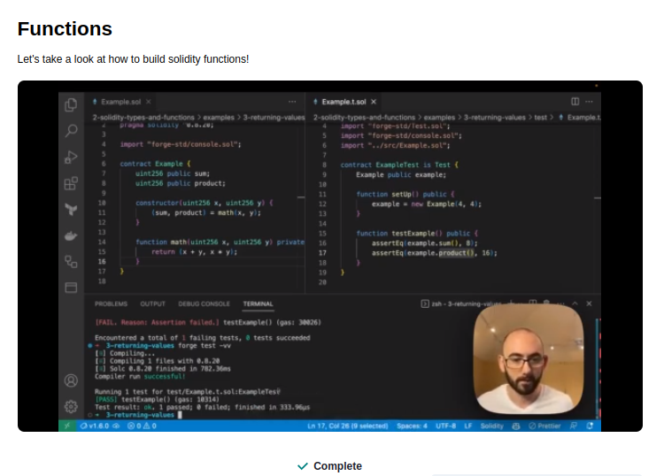

**Practice Solidity Functions**

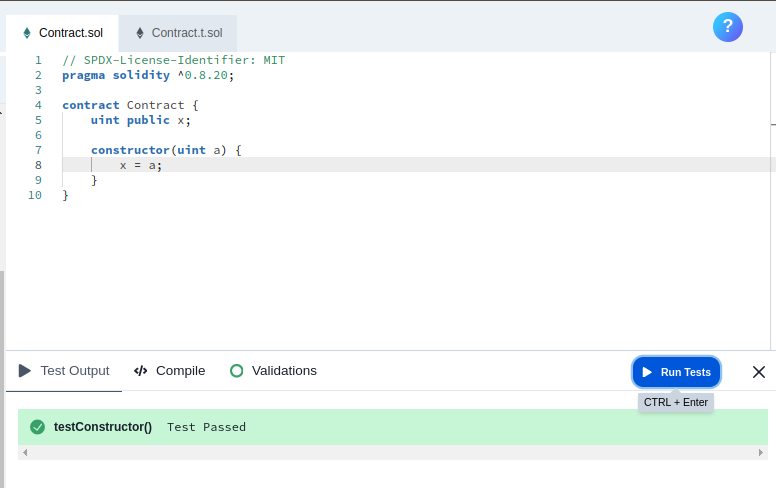

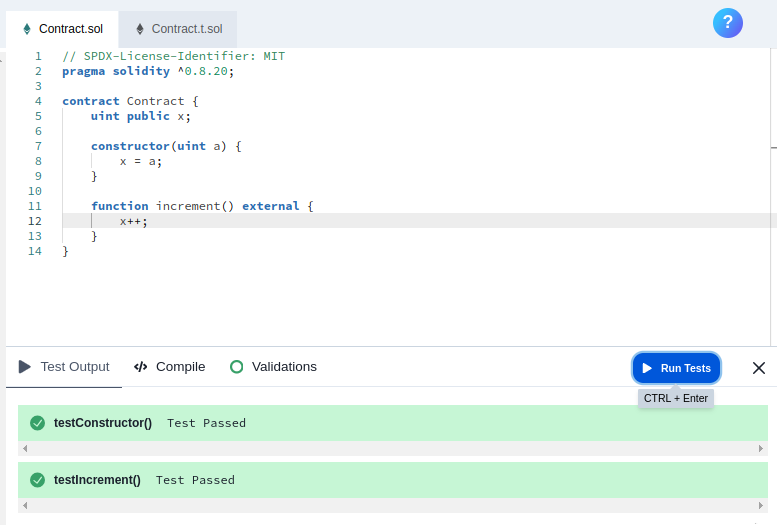

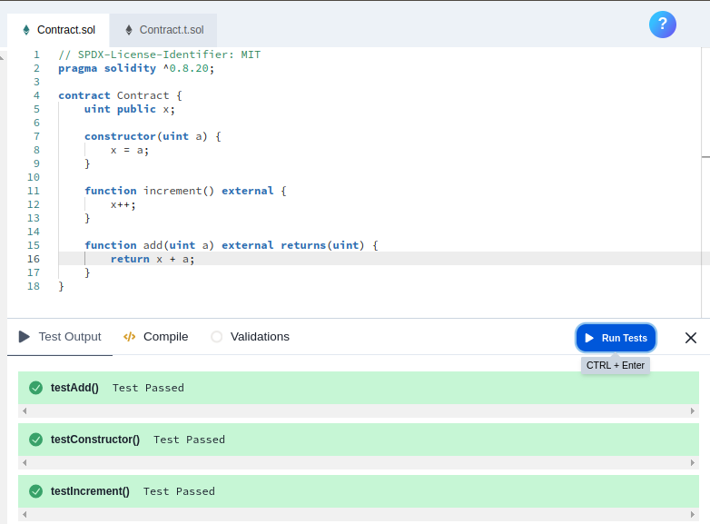

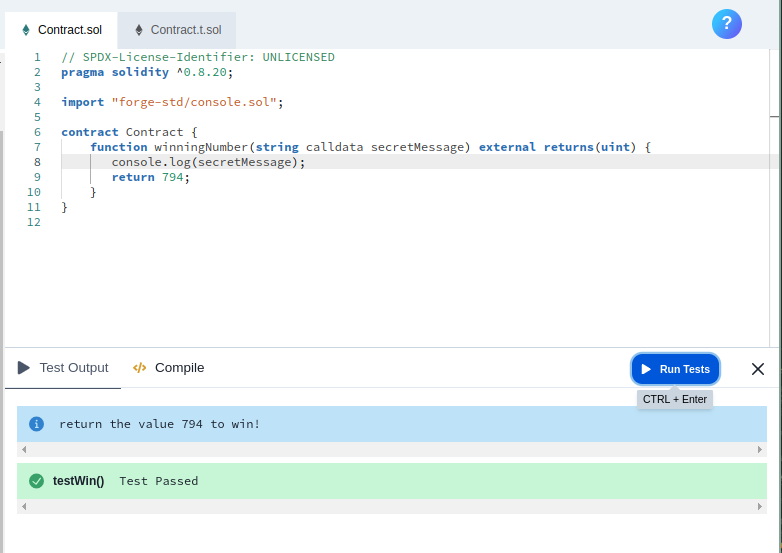

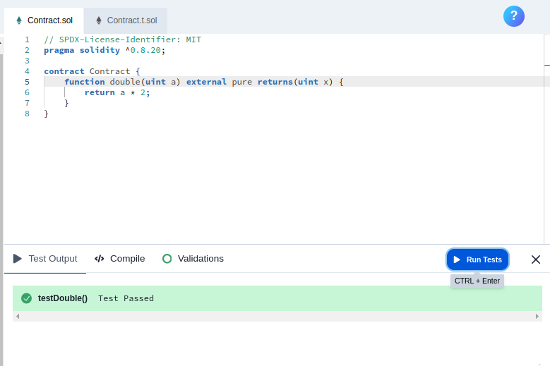

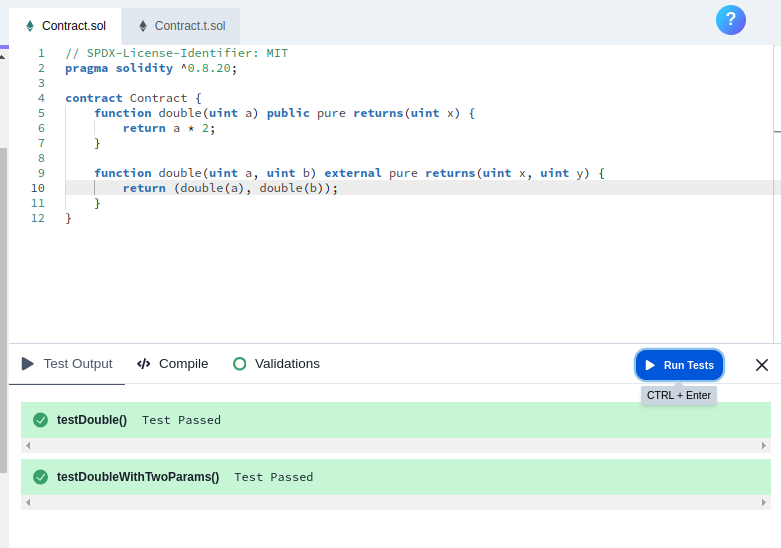